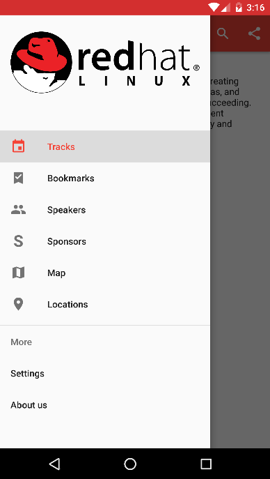
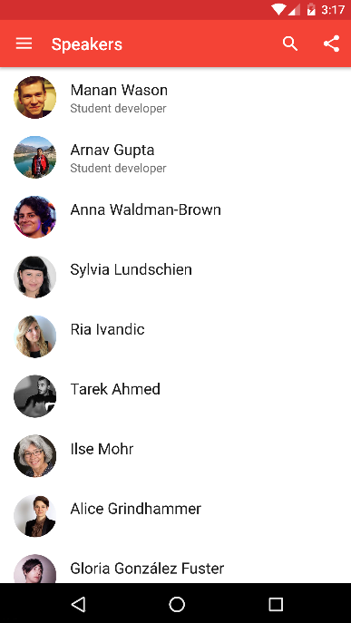

  

## Open Event Android 

Open Event Android consists of 2 main parts :  

1. [App Generator](https://github.com/fossasia/open-event-android/blob/master/docs/ApkGenerator.md) hosted on a server
2. [Android client](https://github.com/fossasia/open-event-android/blob/master/docs/AndroidApp.md) that is can be installed on any Android device for browsing any event

Follow the HyperLinks above for documentation on how to setup the server and android app.

###Video Walkthrough

### Screenshots  

## Documentation

You can find the apk generator docs [here](docs/AndroidApp.md) and the android app docs [here](docs/ApkGenerator.md)

## Branches and Contribution policy
We have the following branches   
 * **development**   
	 All development goes on in this branch. If you're making a contribution,
	 you are supposed to make a pull request to _development_.
	 PRs to master must pass a build check and a unit-test (_app/src/test_) check on Travis
 * **master**   
   This contains shipped code. After significant features/bugfixes are accumulated on development, we make a version update, and make a release.
	 All tagged commits on _master_ branch will automatically generate a release on Github with a copy of ***fDroid-debug*** and ***GooglePlay-debug*** apks.

## A note about Codestyle
Please read our [CODESTYLE](CODESTYLE.md) carefully. Pull requests that do not match the style will be rejected.

## License
This project is currently licensed under the GNU General Public License v3. A copy of LICENSE.md should be present along with the source code. To obtain the software under a different license, please contact FOSSASIA.
