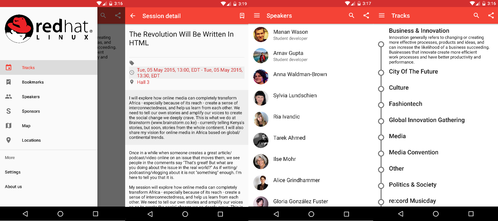
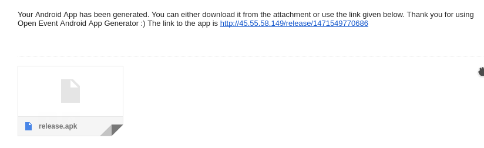

# Open Event Android

[](https://travis-ci.org/fossasia/open-event-android?branch=development)
[](https://codecov.io/github/fossasia/open-event-android?branch=development)
[](https://gitter.im/fossasia/open-event-android?utm_source=badge&utm_medium=badge&utm_campaign=pr-badge&utm_content=badge)
[](https://appetize.io/app/2rfx5pavny47jnb1qzwg204fr8)
[](https://www.codacy.com/app/dev_19/open-event-android?utm_source=github.com&amp;utm_medium=referral&amp;utm_content=fossasia/open-event-android&amp;utm_campaign=Badge_Grade)
[](mailto: fossasia@googlegroups.com)
[](http://digitalocean.com)


The Open Event Android project consists of two components. The **App Generator** is a web application that is hosted on a server and generates an event Android app from a zip with JSON and binary files ([examples here](http://github.com/fossasia/open-event)) or through an API. The second component we are developing in the project is a generic **Android app** - the output of the app generator. The mobile app can be installed on any Android device for browsing information about the event. Updates can be made automatically through API endpoint connections from an online source (e.g. server), which needs to defined in the provided event zip with the JSON files. The Android app has a standard configuration file, that sets the details of the app (e.g. color scheme, logo of event, link to JSON app data).

##Communication

Please join our mailing list to discuss questions regarding the project: https://groups.google.com/forum/#!forum/open-event

Our chat channel is on gitter here: https://gitter.im/fossasia/open-event-android

<br>

## 1. Android App

This is a generic app that has two parts:

A) A standard configuration file, that sets the details of the app (e.g. color scheme, logo of event, link to JSON app data). A sample of the JSON format is maintained in the [Open Event Repository](http://github.com/fossasia/open-event).

B) A JSON API provided by open-event-orga-servers server (Code maintained [here](https://github.com/fossasia/open-event-orga-server)).

### Sample App

A sample app for testing purposes is automatically built after commits in the repository. Please [download and test the app here](/sample-apk).

### Screenshots of a sample Android app



### Android App Development Set up

Please find info about the set up of the Android app in your development environment [here](https://github.com/fossasia/open-event-android/blob/development/docs/ANDROID_APP_Setup.md).

### Data retrieval

- The orga-server provides the data which is stored in its backend database in a json format.
- The app on startup picks up data from a JSON file in its assets folder if the version number of data is -1, which happens when there is no internet connection
- If there is a valid internet connection, the data download starts from the server.
- Also there is a check on the version of data already there in the app's database. If data is stale then only it is downloaded.
- If database is empty then firstly JSON file in assets is accessed but if internet is available , latest data is downloaded.

### Libraries used and their documentation

- Otto [Docs](http://square.github.io/otto/1.x/otto/)
- Retrofit [Docs](http://square.github.io/retrofit/2.x/retrofit/)
- ButterKnife [Docs](http://jakewharton.github.io/butterknife/javadoc/)
- Timber [Docs](http://jakewharton.github.io/timber/)
- Google Gson [Docs](http://www.javadoc.io/doc/com.google.code.gson/gson/2.7)
- LeakCanary [Docs](https://github.com/square/leakcanary)
- Picasso [Docs](http://square.github.io/picasso/2.x/picasso/)

### Devices tested on

| Device        | Android Version           | Skin/ROM      |
| ------------- |:-------------|-------------|
| OnePlus 3     | Android 6.0  | OxygenOS |
| Nexus 5X    | Android 7.0      |  AOSP |
| Nexus 5X    | Android 6.0      |  CyanogenMod 13 |
| Nexus 5    | Android 4.4      |  AOSP |
| Redmi Note 3 | Android 5.0  | MIUI|

<br>

## 2. App Generator

The App Generator is a simple one-page HTML webpage that allows the user to input details and upload or link to the required event data to automatically build the Android application. The user needs to provide the following:

1. App's Name
2. E-Mail address where the generated app will be sent to
3. a) Either a zip with all event data including JSON data and binary image and audio files or b) an API Link providing the same information as the zip file

The Generator needs to be hosted on a server backed up by a PHP script which in turn executes Python and Bash scripts which start the app's build process. After the app is generated, it is emailed to the user using [Mutt](http://www.mutt.org/) and [MSMTP](http://msmtp.sourceforge.net/).

For the API part, the app does not use Firebase for sending data to the server, instead the app directly sends data to `api.php` in the API call. Digging deeper in the code of `api.php`, first the app checks for a valid request (GET/POST) and throws an error if it is invalid. Next, for a valid request the app stores the body into a variable and then executes a follow-up script.

### Sample app

A sample installation of the app generator web-page is [here](http://45.55.58.149/). For the access to the API please use http://45.55.58.149/api/api.php. You can use a sample of the JSON format from the [Open Event Repository](http://github.com/fossasia/open-event).

### Installation of the Web App Generator

#### How do I install Web App Generator on a Server

Please check out [the documentation here](/docs/INSTALLATION.md).

#### How do I install Web App Generator on my local machine

Please check out [the documentation here](/docs/INSTALLATION_LOCAL.md).

#### How do I install Web App Generator on Google Cloud

To install the system on Google Cloud please refer to the [Google Cloud installation readme](/docs/INSTALLATION_GOOGLE.md).

#### How do I install Web App Generator on AWS

To install the system on AWS please refer to the [AWS installation readme](/docs/INSTALLATION_AWS.md).

#### How do I install Web App Generator on Digital Ocean

To install the system on Digital Ocean please refer to the [Digital Ocean installation readme](/docs/INSTALLATION_DIGITALOCEAN.md).

#### How do I install Web App Generator on Docker

To install system with Docker please refer to the [Docker installation readme](/docs/INSTALLATION_DOCKER.md).

#### How do I deploy Web App Generator with Heroku

Please read how to deploy to [Heroku here](/docs/HEROKU.md)

### Accessing the App Generator

An app generator can be accessed in two ways, via an App Generator Web-Page, that runs on an the APACHE server or via POST API. The POST API takes input in form of a JSON and then creates and emails you the app. To access it via a POST API in your app installation you need to go to http://your-URL/api/api.php. The POST API takes input in form of a JSON and then creates and emails you the app.

### Sending a POST Request

You can use [Postman](https://chrome.google.com/webstore/detail/postman/fhbjgbiflinjbdggehcddcbncdddomop?hl=en) for Chrome or [RESTClient](https://addons.mozilla.org/de/firefox/addon/restclient/) for Firefox for making API calls easily.

Input to the API should be of the following format <br>
```{ "email": "example@example.com", "app_name": "Name", "endpoint": "http://valid-endpoint.com/" } ```<br>

After taking the request through the POST API, the app will be generated and emailed to the email address provided in the request body.

### Components

* **[index.html](https://github.com/fossasia/open-event-android/blob/master/apk-generator/index.html)** A HTML file which can server as the landing page for your server.
* **[runPy.php](https://github.com/fossasia/open-event-android/blob/master/apk-generator/scripts/runPy.php)** A PHP script that will launch python script by taking input from index.html.
* **[appgenserver.py](https://github.com/fossasia/open-event-android/blob/master/apk-generator/scripts/appgenserver.py)** A Python script containg commands to compile and generate the app
* **[clone.sh](https://github.com/fossasia/open-event-android/blob/master/apk-generator/scripts/clone.sh)** A bash script used for cloning the source code for android app onto the server.
* **[buildApk.sh](https://github.com/fossasia/open-event-android/blob/master/apk-generator/scripts/buildApk.sh)** A bash script used for initiating the app's build and signing it once the app has been generated.
* **[email.sh](https://github.com/fossasia/open-event-android/blob/master/apk-generator/scripts/email.sh)** A bash script used to send the email containing the generated app as an attachment.
* **[upload.php](https://github.com/fossasia/open-event-android/blob/development/apk-generator/scripts/upload.php)** A PHP script that will upload the json zip that is chosed by the user.
* **[uploadhelper.php](https://github.com/fossasia/open-event-android/blob/development/apk-generator/scripts/uploadHelper.php)** Takes in the timestamp of user as input and moves the uploaded script to a unique location for each user.
* **[api.php](https://github.com/fossasia/open-event-android/blob/development/apk-generator/api/api.php)** A PHP script that serves as an API and handles incoming requests to the server.
* **[copyapk.sh](https://github.com/fossasia/open-event-android/blob/development/apk-generator/scripts/copyApk.sh)** A bash script that will copy the generated and signed apk to the release folder in `public-html` of the server.

### Screenshots of the app generator web page
**See it in action** <br>
 <br>

**Firebase Data Storage model** <br>


**Received email with the compiled app**



## Contributions, Bug Reports, Feature Requests

This is an Open Source project and we would be happy to see contributors who report bugs and file feature requests submitting pull requests as well. Please report issues here https://github.com/fossasia/open-event-android/issues

## Branch Policy

We have the following branches   
 * **development**   
	 All development goes on in this branch. If you're making a contribution,
	 you are supposed to make a pull request to _development_.
	 PRs to master must pass a build check and a unit-test (_app/src/test_) check on Travis
 * **master**   
   This contains shipped code. After significant features/bugfixes are accumulated on development, we make a version update, and make a release.
	 All tagged commits on _master_ branch will automatically generate a release on Github with a copy of ***fDroid-debug*** and ***GooglePlay-debug*** apks.

## Codestyle
For contributions please read the [CODESTYLE](docs/CODESTYLE.md) carefully. Pull requests that do not match the style will be rejected.

## License
This project is licensed under the GNU General Public License v3. A copy of [LICENSE](LICENSE.md) is to be present along with the source code. To obtain the software under a different license, please contact FOSSASIA.

## Maintainers
The project is maintained by
- Harshit Dwivedi ([@the-dagger](https://github.com/the-dagger))
- Manan Wason ([@mananwason](https://github.com/mananwason))
- Mario Behling ([@mariobehling](http://github.com/mariobehling))
- Justin Lee ([@juslee](http://github.com/juslee))
