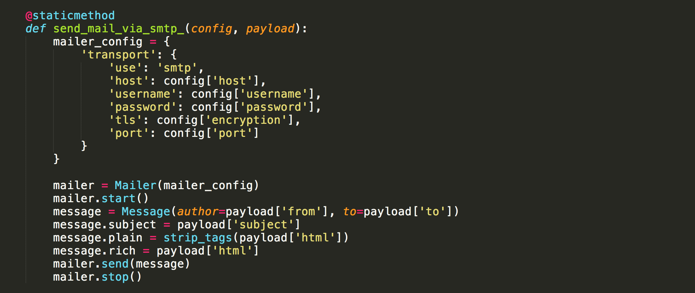
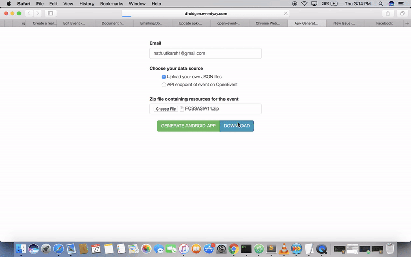

## How apk is generated using the Android apk generator

## **Getting the data from uploaded zip/url**


The web server and the celery worker run as two separate instances. Data is passed between them via redis. Jobs with payload are added to redis by the web app.
The moment the `GENERATE ANDROID APP` button is pressed, a `POST` request through function `process` is being made in the file `open-event-android/apk-generator/v2/app/views/__init__.py` where the respective email and the data source is stored.


A celery task is created with a payload containing the data submitting by the user. In case of a file, it is saved and the payload contains the path to the file, whereas in case of an API endpoint, the payload contains the url.
After that, the page tells the user that his request is being processed.Now, the celery worker will start processing the task in the background with the help of the function `generate_app_task` which will further call function `generate_app_task_base` both in the file `open-event-android/apk-generator/v2/app/tasks/__init__.py`. An object of the class `generator` is created in `generate_app_task_base` function which is used to call the `generate` method that returns the apk url.


## **Generating the app**

### Normalizing the data

First, the `normalize` function of [generator.py](../apk-generator/v2/app/generator/generator.py) is called with the creator email, API endpoint URL and the zip file as arguments. The task of normalize function is to replace the specific data inside app source files like app name, event name and logo, etc to customize the app according to the provided event data.
- Firstly, it checks if API endpoint or payload zip is provided or not, and sends error to the client if it isn't
- Then according to the type of data provided, it prepares to load the data:  
    - URL Endpoint:
        - Saves the API link for further use
        - Creates the assets directory in application
        - Loads the `/event` data from endpoint into JSON  
    - Payload Zip:
        - Extracts the zip
        - Saves the event JSON data from file
- Loads the required event data from the JSON
- Parses and downloads the event logo and background

### Building the app

When the `generate` function is called, the app build process takes place in the following steps:
- Prepares the source by removing the previously present files like logos and JSON files in assets
- Generates the app package name and `config.json` containing the
    - Creator Email
    - App name
    - API link
- Resizes the logo and background images in various Android DPIs
- Replaces the static string throughout the project with the event specific ones
- Loads the asset JSON files of in `assets` folder
- Prepares the build tools by loading its version and path
- *Executes the [build script](../apk-generator/v2/scripts/build_apk.sh)* which does the following:
    - Build the release version of the app
    - Sign the app with key using the key path, store password and alias loaded from environment variables
    - Zipalign the app
- Copies the generated release apk in a public `app` folder and generate apk url
- Return the generated apk URL and optionally notifies socket.IO client about the completion of process

## **Delivery Options**

After generation of the app, we have two option for delivery of the apk

 1. ### Email
  For email we use Marrow Mailer. We have a class Notification for sending emails at 
 `open-event-android/apk-generator/v2/app/utils/notification.py` and functions in this class is called in `apk-generator/v2/app/generator/generator.py`
  
notification.py has two functions 
- send  (under development)
- send_mail_via_smtp_  (for sending mails)
    


2. ### Direct download 
On clicking the Download button `/app/<string:identifier>/download` url is hit with `GET` method `app_download(identifier)` in `open-event-android/apk-generator/v2/app/views/api.py`
identifier is the argument which is the filename of the file.
It is downloaded to the location with path as  `BASE_DIR/app/static/releases/filename.apk`
If the above file is not present then the download is aborted otherwise it returns the absolute path of the downloaded file.




### Keeping the repo size small

After each travis build, apk artifacts are generated which are pushed on the apk branch. As each apk file gets uploaded, the repo size keeps increasing as git does not store incremental changes of binary files, and instead stores them as full sized blobs.  
So, in order to remove stale apk files from the repository and thus keep the size of the repo small, this code is used from `upload_apk.sh`


```shell
# Create a new branch that will contains only latest apk
git checkout --orphan latest-apk-only

# Add generated APKs.
git add -f .
git commit -m "Update Sample Apk generated from $TRAVIS_BRANCH branch."

# Delete current apk branch
git branch -D apk
# Rename current branch to apk
git branch -m apk

# Force push to origin since histories are unrelated
git push origin apk --force --quiet > /dev/null
```

- Create a new `orphan` branch for only the latest apk. Orphan branches work like when you create a new project and do `git init`, meaning they are devoid of any previous files commited in the repo and start fresh. This branch's name is `latest-apk-only`
- Add all the (apk) files and commit them
- Then delete the old `apk` branch since it contains state app which is not needed in git history
- Rename current branch to `apk` branch
- Force push results to `apk` branch of origin to update the online repository according to local copy. Forced push is needed because the git history and hence the refs are modified in local repo and hence online repo won't be able to merge the changes automatically. Since we are not concerned about the history of `apk` branch, we quietly force push the apk to it.